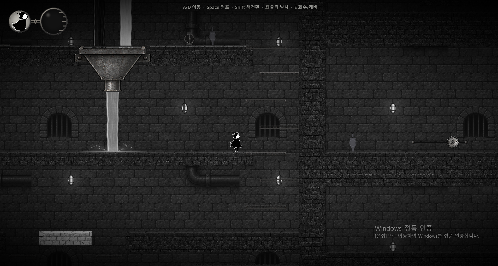

# ver.2 1단계: 비교 화면 고정

## 고정 기준
- 원본: 사용자 제공 실제 플레이 화면. 1908×1022 PNG를 무보정·무크롭 복사, 해시 검증 완료.
- 구간: stage_2-9, C_혼합호퍼 / D_호퍼출력 / 오른쪽 수직벽과 격자 / 하단 흰 발판.
- 씬 저장 줌0.8. project.godot 뷰포트 및 창 오버라이드1920×1080. 실제 이미지와 크기가 다르므로 같은 해상도로 촬영했다고 간주하지 않는다.
- 캐릭터 발 위치는 화면 약(905,583), 월드 약(2130,3712)로 추정. 카메라 원점/실효 배율은 엔진에서 읽기 전 미확정.
- 원본 화면에 보이는 HUD와 워터마크는 밝기/재질 비교 영역에서 제외한다.
- baseline.json은 현재 파일 상태의 SHA256도 기록한다. 사용자 캡처 시점의 코드와 동일함을 증명하는 해시는 아니다.

## 이 화면에서 비교할 항목
1. 왼쪽 상단 호퍼: 주철 재질, 입구 혼합색, 출구 연결.
2. 호퍼 아래 물줄기: 본체 명도, 반사선, 바닥 착수 물보라.
3. 중앙 벽등: 등 본체 형태와 주변 벽의 밝기 변화.
4. 중앙 배경 벽돌과 발밑 지형: 크기/질감 차이, 명도 대비, 이동 경계 가독성.
5. 오른쪽 수직벽: 배경과 앞 지형의 분리.
6. 화면 가장자리: 비네트가 플레이 경계를 숨기지 않는지.

## 이번 단계의 제한
이 구간에는 세 색 웅덩이와 입수 순간이 함께 보이지 않는다. 그 검증에는 별도 보조 구간이 필요하며 이 화면으로 통과 처리하지 않는다.
현재 원본 비교 기준은 확보했지만 같은 화면을 자동 재현하는 단계는 미완료다. Godot 실행 허용 후 실제 카메라 변환/창 크기/플레이어 위치를 읽어 재현 확인해야 한다. 이번 작업에서는 엔진을 실행하지 않았다.

## 다음 단계
이 PNG 자체를 바탕으로 지형·캐릭터·카메라·장치 배치를 고정한 구현용 목표 시안을 만든다. 자유롭게 재구성한 새로운 방 그림과 비교하지 않는다. 이 단계에서는 게임의 디자인 값을 수정하지 않았다.
