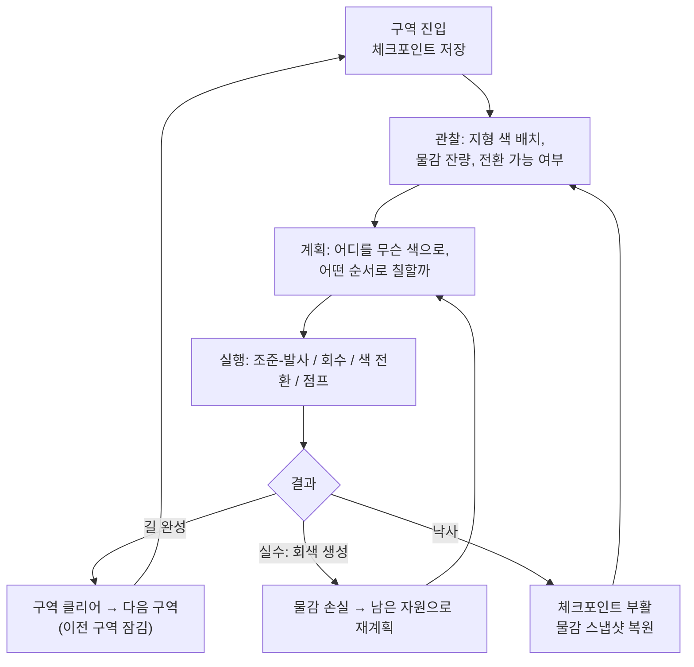
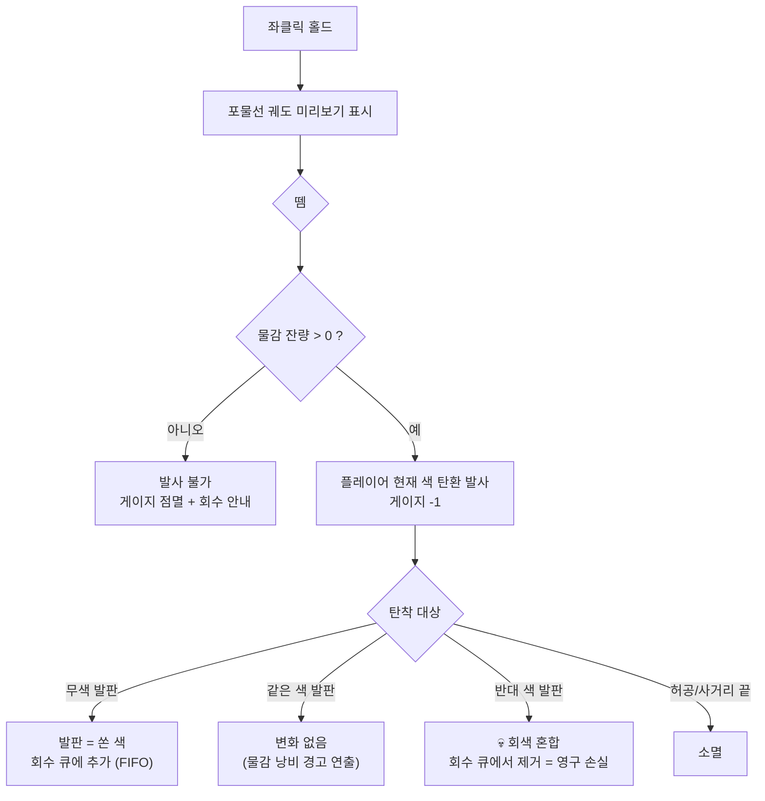
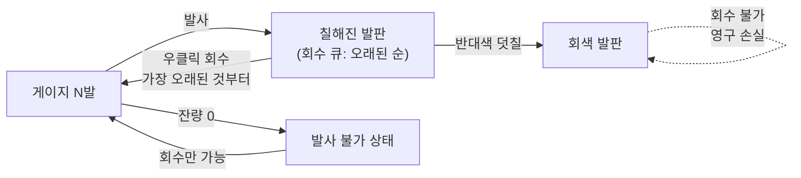
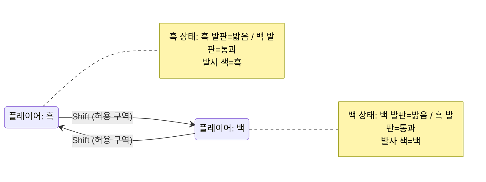
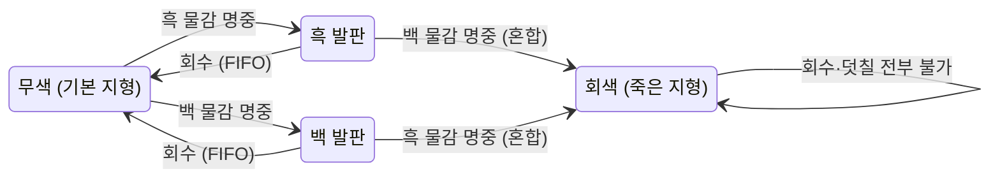
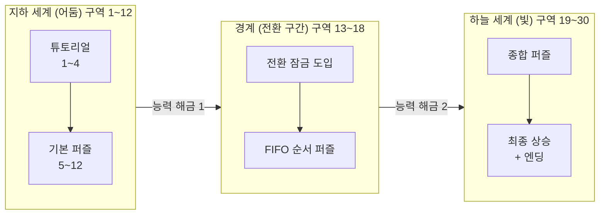

# GRAY — 규칙·시스템 확정 기획서 + 플로우차트 (v1)

> 작성: 도형 (LD·리드 기획) / 2026-07-13
> 목적: **프로그래머 작업 언블록.** 최우선 결정 5건(7/15 마감)의 추천안 + 전체 상호작용 명세 + 플로우차트.
> 근거 문서: 개발 일정표(7/13→8/4), 게임_스토리_기획안_ACFG조합, 도형_신우_스토(GRAY), 배경·지형 디자인 컨셉 초안, dev_4 현재 코드.
> 표기: ✅확정(코드에 이미 있음/팀 합의) · 🟡추천(이 문서의 제안, 7/15까지 확정 필요) · ⬜미정

---

## 0. 게임 한 줄 정의

> **흑백 세계를 오르는 소년이, 제한된 물감을 쏘고·되찾으며 길을 만든다.**
> 잘못 섞으면 회색 — 되돌릴 수 없다. 꼭대기에 닿는 순간, 세계에 색이 돌아온다.

- 장르: 2D 퍼즐 플랫포머 (수직 상승, 30구역)
- 팀: LD(도형) · P-A(색·총·물감·경계) · P-B(카메라·진행·체크포인트·UI) · ART · TB(타일맵 빌더)
- 기간: 7/13~8/4 (D-22). M1 코어 프로토 7/19 · M2 메커닉 7/26 · M3 콘텐츠 8/2 · M4 제출 8/4

---

## 1. 상호작용 전체 명세 (★핵심 — 모든 시스템이 서로 어떻게 물리는가)

### 1-1. 자원: 물감 (횟수제)

```
물감 게이지 (흑/백 공용, 최대 N발)
 → 발사 1회 = 1 차감 (쏜 색이 흑이든 백이든 동일)   ✅(일정표 확정)
 → 0이 되면 발사 불가 → "회수"로만 다시 채움
 → 회수 = 과거에 칠한 것을 되돌려 +1              ✅(FIFO, 일정표 확정)
 → 단, 회색이 된 물감은 영원히 회수 불가            ✅(일정표 확정)
```

**왜 이 구조인가**: 물감이 무한이면 "아무 데나 다 칠하면 됨"이라 퍼즐이 사라진다. 횟수 제한 + 회수 + 회색 손실이 합쳐져야 "어디에, 몇 발을, 어떤 순서로 쓸까"라는 **계획 퍼즐**이 성립한다. (Portal의 포탈 2개 제한, Baba Is You의 규칙 블록 개수 제한과 같은 원리 — 자원이 적을수록 한 수의 무게가 커진다.)

### 1-2. 발사 체인 (한 발을 쏘면 일어나는 일)

```
플레이어(현재 색: 흑 or 백)
 → 좌클릭 홀드 = 조준: 포물선 궤도 미리보기 표시      ✅(일정표: gun.gd 재작업 W1)
 → 뗌 = 발사: "플레이어의 현재 색" 물감 탄환이 포물선으로 날아감
 → 물감 게이지 -1
 → 탄착 판정:
    ├─ 무색(회색조 기본) 지형 명중 → 그 발판이 [쏜 색]으로 칠해짐
    │    └─ 흑으로 칠한 발판 = 흑 상태 플레이어가 밟을 수 있는 발판이 됨 (1-4 규칙)
    ├─ 이미 [같은 색] 발판 명중 → 변화 없음, 물감만 낭비 (경고 연출)   🟡
    ├─ 이미 [반대 색] 발판 명중 → 💀 회색으로 혼합                    ✅
    │    └─ 회색 발판 = 회수 불가. 그 발판에 쓴 물감 총 2발이 영구 손실
    │    └─ 회색 발판의 판정: 흑·백 누구도 못 밟는 "죽은 지형"          🟡(추천, 아래 결정⑥)
    └─ 지형 아님(허공) → 일정 거리/시간 후 소멸, 물감은 이미 차감됨
```

**왜 포물선인가**: 직선 즉발은 "보이면 무조건 맞음"이라 조준에 선택이 없다. 포물선은 ①장애물 너머 곡사(벽 뒤 발판 칠하기) ②거리 조절이라는 **손맛 요소**를 만들고, 홀드→궤도 미리보기가 있어 억울한 미스가 없다. (Angry Birds·Worms가 증명한 문법.)

**왜 회색이 무서운가**: 회색은 단순 실패가 아니라 **자원 2발 + 그 발판 영구 손실**이다. "반대색 위에 덧쏘면 안 된다"는 긴장이 모든 조준에 깔린다. 이것이 이 게임 고유의 리스크 시스템 — 다른 색칠 게임(Splatoon, de Blob)에는 없는 "되돌릴 수 없음"의 무게다. 스토리 주제(흑백을 섞으려는 시도의 대가)와도 맞물린다.

### 1-3. 회수 체인 (물감을 되찾을 때 일어나는 일)

```
회수 입력 (🟡추천: 우클릭 = 수동 회수, 아래 결정③)
 → 가장 먼저 칠한 발판부터 순서대로 되돌아옴 (FIFO = 선입선출)  ✅
 → 되돌아온 발판: 색이 사라지며 원래 상태(무색)로 복귀
    └─ ⚠ 그 발판을 밟고 있던 중이면 → 발밑이 사라짐 → 낙하
 → 물감 게이지 +1
 → 회색 발판은 회수 큐에서 제외 (영구 손실)                    ✅
```

**왜 FIFO가 퍼즐이 되는가**: 회수 순서를 플레이어가 고를 수 없기 때문에, **칠하는 순서 자체가 퍼즐의 답**이 된다. "3번 발판을 나중에 회수해야 하니 먼저 칠하면 안 된다" 같은 역산 사고를 요구한다. 이는 하노이 탑/후입선출 퍼즐의 문법으로, 조준(실시간)과 계획(퍼즐)을 한 시스템에 묶는 이 게임의 독창적 지점이다.

### 1-4. 색 전환 체인 (Shift를 누르면 일어나는 일)

```
Shift 입력                                          ✅(코드 구현됨)
 → 경계(구역) 판정:
    ├─ 전환 허용 구역 안 → 플레이어 색 흑↔백 반전
    │    ├─ 밟을 수 있는 지형이 반전됨:
    │    │   흑 플레이어 = 흑 지형만 밟음 / 백 지형은 통과      🟡(추천, 아래 결정⑦)
    │    ├─ 지금 반대색 발판 위에 서 있었다면 → 즉시 통과 → 낙하
    │    │   └─ 이것이 이 게임의 "가시" 대체물 = 색 기반 낙사   ✅(일정표: 직접충돌 장애물 삭제)
    │    └─ 공중에서 전환 가능 → "낙하 중 전환해서 아래 발판에 착지" 테크닉
    └─ 잠김 구역(경계 밖) → 전환 불가, HUD에 잠김 표시          ✅(일정표: 경계 시스템)
```

**왜 경계(전환 잠금)가 필요한가**: 아무 데서나 전환되면 모든 색 퍼즐이 "전환하면 그만"으로 풀린다. 전환을 **공간 자원**으로 만들면(여기선 되고 저기선 안 됨) 같은 지형도 구역에 따라 다른 퍼즐이 된다. Celeste가 대시 회복을 "바닥 착지"라는 공간 조건에 묶은 것과 같은 설계다.

### 1-5. 사망·부활 체인

```
사망 조건: 낙사(구역 하단 킬존) — 가시·톱니 등 직접충돌 장애물은 삭제됨  ✅
 → 체크포인트에서 부활                                              ✅(P-B W2)
 → 부활 시 물감 상태: 🟡추천 = "체크포인트 통과 시점의 스냅샷으로 복원"
    (죽기 직전 상태 유지면 회색 실수가 누적된 채 갇힐 수 있음 → 소프트락)
```

### 1-6. 진행 체인 (구역 → 구역)

```
구역(룸) 클리어 → 다음 구역 진입
 → 리틀나이트메어식: 구역을 넘으면 이전 구역으로 복귀 차단          ✅(P-B W1)
 → 메트로배니아 요소: 능력 해금(예: 물감 최대치+, 회수 강화)        ⬜(해금 목록 LD W1)
 → 🟡충돌 해소 추천: 백트래킹은 "지역(챕터) 안"으로만 한정 (아래 결정⑤)
 → 30구역 = 지하(어둠) → 경계 → 하늘(빛), 오를수록 밝아짐          ✅(배경 컨셉)
```

### 1-7. 상호작용 우선순위 한눈표

| 내가 이걸 하면 | 이것이 일어나고 | 그래서 이것이 바뀐다 |
|---|---|---|
| 좌클릭 홀드 | 포물선 궤도 표시 | 착탄 지점 예측 가능 |
| 좌클릭 뗌 | 내 색 물감 발사, 게이지 -1 | 잔량이 줄어 다음 수가 무거워짐 |
| 무색 발판 명중 | 발판이 내 색이 됨 | 그 색 상태에서 밟을 수 있는 길 생성 |
| 반대색 발판 명중 | 회색으로 혼합 | 발판 영구 사망 + 물감 2발 손실 |
| 우클릭(회수) | 가장 오래된 칠부터 복구, 게이지 +1 | 그 발판 길이 사라짐 (밟는 중이면 낙하) |
| Shift (허용 구역) | 내 색 흑↔백 반전 | 밟는 지형 반전, 반대색 위면 낙하 |
| Shift (잠김 구역) | 아무 일도 없음 + 잠김 피드백 | 전환 없이 풀어야 하는 구역임을 인지 |
| 구역 경계 통과 | 이전 구역 복귀 차단, 체크포인트 | 진행 확정, 물감 스냅샷 |

---

## 2. 플로우차트

### 2-1. 코어 게임 루프



### 2-2. 발사 파이프라인 (P-A 구현 기준)



### 2-3. 물감 자원 순환 (이 게임의 심장)



### 2-4. 색 전환·판정 상태도





### 2-5. 구역 진행 구조



---

## 3. 🔴 최우선 결정 5건 — 추천안 (7/15 확정, LD 주도)

| # | 결정 항목 | 추천안 | 근거 (요약) |
|---|---|---|---|
| ① | 아트 스타일 | **절충안: 배경·캐릭터=일러스트, 지형=타일** | ART 1명·3주에 4지역. 배경은 컨셉 초안의 레이어 일러스트가 이미 방향 확정. 지형은 TB의 타일 파이프라인과 직결 — 타일이어야 30구역을 찍어낼 수 있음. 발판 목업 1장씩 만들어 7/15 비교만 하면 끝 |
| ② | 타일 격자 규격 | **32×32px 고정** | 16px는 30구역 채우기에 손이 너무 많이 가고, 64px는 포물선 조준 대비 발판이 너무 큼. 캐릭터 키 = 타일 1.5~2칸 기준. ⚠현재 dev_4 타일셋은 16px 기준이므로 확정 즉시 TB와 함께 교체 |
| ③ | 물감 회수 트리거 | **수동(우클릭) 기본. 자동 회수 금지** | "횟수 0 시 자동"은 밟고 있던 발판이 갑자기 사라져 낙사 = 억울한 죽음(퍼즐 게임 최악). "근접 회수"는 동선 퍼즐로는 좋지만 구현+레벨 비용 큼 → 2차 후보로 보류. 수동+FIFO는 HUD에 "다음 회수될 발판" 표시만 있으면 완성 |
| ④ | 칠하는 범위 | **발판(오브젝트) 전체 단위** | 타일 1칸 단위는 반쯤 칠해진 발판이 생겨 "어디까지 밟히는지" 모호(가독성 붕괴) + 회수 단위도 애매해짐. 발판 전체 = Hue와 같은 "오브젝트 하나에 색 하나" 문법이라 인지 부하 최소. FIFO 큐도 "발판 목록"으로 깔끔. 구현도 타일 그룹/오브젝트 프로퍼티라 더 쉬움 |
| ⑤ | 메트로배니아 ↔ 리틀나이트메어 충돌 | **일방향 진행 기본 + 백트래킹은 "지역(챕터) 안"으로 한정** | 30구역·3주에 전맵 백트래킹은 스코프 초과(카메라·진행·맵UI 전부 복잡해짐). 지하/경계/하늘 각 지역 안에서만 해금 후 재방문 허용, 지역을 넘으면 잠김. 상승 서사(위로만 간다)와도 정합. P-B의 "구역 넘으면 복귀 차단"을 "지역 넘으면 차단"으로 한 단계 완화하는 것 |

### 추가 확정 필요 (5건에 딸린 세부 — 프로그래머가 어차피 물어볼 것)

| # | 항목 | 추천 |
|---|---|---|
| ⑥ | 회색 발판의 판정 | **흑·백 모두 못 밟는 "죽은 지형"** (감속 아님 — dev_2의 회색=감속 규칙은 폐기). 회색이 통행 가능하면 페널티가 페널티가 아님 |
| ⑦ | 색-지형 판정 방향 | **같은 색 = 밟음, 반대 색 = 통과** (OVIVO 방식). "내 색이 내 발판"이 직관적이고, 캐릭터 실루엣이 반대색 지형 위에서 항상 선명하게 보임 |
| ⑧ | 부활 시 물감 | 체크포인트 통과 시점 스냅샷 복원 (회색 실수 후 사망 시 소프트락 방지) |
| ⑨ | 조준 취소 | 홀드 중 우클릭 or ESC = 발사 취소 (물감 차감 없음) |
| ⑩ | 같은 색 덧칠 | 변화 없음 + 낭비 경고 연출 (차감은 유지 — "확인 사격"도 비용) |

---

## 4. 유사 게임 비교 — 재미 요소를 어디서 가져오고 어디서 다른가

| 게임 | 가져올 것 | 우리가 다른 점 (=우리의 재미) |
|---|---|---|
| **OVIVO** | 흑백 전환 지형 문법(검정일 때 검정을 탐), 레벨 전체가 한 장의 그림 | OVIVO는 전환이 무제한·무비용. 우리는 **전환이 구역에 잠기고, 지형 색을 내가 만든다** |
| **Hue** | 오브젝트 단위 색 규칙("배경색과 같으면 사라짐"), 색 하나 풀릴 때마다 퍼즐 어휘 증가 | Hue는 색을 고르기만 함. 우리는 색을 **쏘고·회수하는 자원**으로 만듦 |
| **Portal** | 자원 2개 제한이 만드는 계획 퍼즐, 초반 해법 1개 고정으로 규칙 학습 보장, 플레이테스트 주도 | 포탈은 회수가 공짜(재발사). 우리는 **FIFO + 회색 영구 손실**이라는 되돌릴 수 없음이 있음 |
| **The Unfinished Swan** | "물감을 던져 세계를 드러낸다"는 발사 손맛, 흰 세계에 검은 탄착의 쾌감 | 그쪽은 탐험 연출용. 우리는 탄착이 **물리 판정을 만드는** 기능성 페인트 |
| **Splatoon** | 칠한 영역 = 내 영역이라는 소유감, 잉크 게이지 관리 | 실시간 슈터가 아니라 퍼즐. 잉크가 **유한하고 순서가 기억됨** |
| **Celeste** | 룸 하나 = 아이디어 하나, 신규 요소는 안전한 방에서 소개, 공중 조작 테크닉(낙하 중 전환) | — (방법론 그대로 채택, 레벨디자인 가이드 참조) |
| **Ikaruga** | 흑백 극성 전환의 긴장(내 색이 곧 생사) | 슈팅 반사신경이 아니라 **사전 계획**으로 옮김 |

**우리 게임만의 재미 정의 (기획서 명시용)**:
1. **조준의 손맛** — 포물선 커브샷으로 원하는 발판을 정확히 내 색으로 만드는 쾌감 (실시간 스킬)
2. **순서의 퍼즐** — FIFO 회수 때문에 "칠하는 순서"를 역산하는 두뇌 플레이 (계획 스킬)
3. **되돌릴 수 없음의 긴장** — 회색 한 번의 실수가 남은 퍼즐 전체를 바꾸는 무게 (리스크 관리)
4. **전환 낙하 테크닉** — 공중에서 Shift로 밟을 지형을 바꿔 착지하는 액션 (숙련 보상)

이 4개가 각각 ①손 ②머리 ③심장 ④몸의 재미로, 서로 다른 플레이어 타입을 전부 커버한다.

---

## 5. 스토리 통합 — "최소 연출 + 엔딩 컬러 전환" 확정안

### 5-1. 왜 기존 스토리를 못 쓰는가 (정리)

- GRAY 스토리(도형_신우_스토): 회색 = "흑백 어느 쪽도 아닌 이해자" = **긍정의 상징**
- 새 규칙: 회색 = 혼합 실수, 회수 불가 페널티 = **부정의 상징**
- → 같은 색이 서사에선 목표, 플레이에선 벌이면 플레이어 감정이 찢어진다 (루도내러티브 부조화). 기존 스토리 그대로는 불가 — 판단 정확함.

### 5-2. 확정 방향: 말하지 않는 스토리 3층 구조

> 원칙: **컷신 0개, 대사 0줄, 조작을 뺏는 시간 0초 (엔딩 제외).** Limbo/Inside가 증명한 환경 서사.

**1층 — 항상 있는 것 (배경이 곧 내레이션)**
- 오를수록 밝아지는 명도 그라데이션(배경 컨셉 확정안 그대로) = "목표에 가까워진다"를 화면이 매 순간 말해줌
- 지하: 매달린 종유석·등불·석조 도시 / 경계: 빛이 스며드는 전환부 / 하늘: 로마 수도교·산토리니 — 별도 연출 비용 0

**2층 — 딱 3번의 "색의 흔적" (최소 연출의 전부)**
- 각 지역의 마지막 구역에 1곳씩, 총 3곳: 벽의 갈라진 틈에서 **2~3초간 유채색이 스며 나왔다 사라짐** (기억의 조각 간소화판)
- 조작 안 뺏음, 텍스트 없음. 구현 = 해당 스프라이트 modulate 트윈 하나
- 효과: 흑백 게임에서 색이 나오는 유일한 순간이라 강렬 + "위에 색이 있다"는 목표 암시 + 엔딩 복선

**3층 — 엔딩: 흑백 → 컬러 (게임 전체의 보상)**
- 최상단 도달 → 마지막 입력(발사 or 회수)과 함께 **탄착 지점에서 원형으로 색이 번져 화면 전체가 컬러로** → 카메라 천천히 줌아웃(올라온 세계 전경이 컬러로 물듦) → 크레딧
- 참조: Gris(색의 귀환=감정 보상의 교과서), Chicory(칠하기=세계 회복)

### 5-3. ★제작 트릭 (ART·프로그래머에게 전달)

> **아트를 처음부터 컬러로 그리고, 게임 중에는 전체 화면 채도 0 셰이더를 씌운다.**
> 엔딩 = 셰이더의 saturation 값을 0→1로 트윈 (탄착 중심 원형 마스크로 번짐).

- 엔딩 연출 비용이 사실상 **셰이더 파라미터 1개** — 별도 컬러 에셋 제작 불필요
- "색의 흔적" 3곳도 같은 셰이더의 부분 마스크로 해결
- 보너스: 개발 중 셰이더만 끄면 컬러 프리뷰 가능, 차기작·홍보 스크린샷에도 활용
- ⚠주의: 규칙색(흑/백/회 지형)은 셰이더 예외 처리 필요 없음 — 원래 무채색이라 채도 0의 영향을 안 받음. 오히려 배경 일러스트만 자연스럽게 흑백화되어 "지형=진한 무채, 배경=중간 계조" 가독성 규칙이 공짜로 지켜짐

### 5-4. 오프닝 (플레이어블, 30초)

- 검은 화면 → 텍스트 2줄만: *"빛이 닿지 않는 곳이 존재합니다."* (배경 컨셉 문구 재사용) → 최심부에서 눈을 뜬 소년, 걷기 시작 → 첫 등불 아래에서 총 획득(=조작 튜토리얼 시작)
- 이유: 짧은 개발 기간에 오프닝 컷신은 사치. 걷기 시작 10초 안에 조작을 줘야 함 (Celeste·Inside 모두 10초 내 조작)

---

## 6. 현재 dev_4 코드 ↔ 이 기획서 갭 (프로그래머 참고)

| 시스템 | 현재 코드 (2026-07-13) | 기획서 목표 | 담당 |
|---|---|---|---|
| 색 전환 | ✅ Shift 토글 (player.gd) | + 경계 잠금 판정 | P-A W2 |
| 발사 | 좌클릭 즉시 직선 (gun.gd) | 홀드→포물선 궤도→발사로 **재작업** | P-A W1 (일정표 명시) |
| 탄착 | 맞은 타일 1칸을 무조건 회색화 (bullet.gd — 임시 구현) | 쏜 색으로 발판 전체 칠하기 + 혼합 규칙 | P-A W1~2 |
| 물감 게이지 | 없음 | 횟수 차감 + HUD | P-A W1 / P-B W3 |
| 회수 FIFO | 없음 | 우클릭 회수 | P-A W2 |
| 판정(색=밟기) | 없음 (전 타일 항상 충돌) | 같은 색만 밟기 | P-A |
| 체크포인트/부활 | 없음 | 스냅샷 부활 | P-B W2 |
| 타일셋 | 16px 임시(Godot 로고), (1,0)(1,1)만 충돌 | 32px 확정 후 교체 | TB W1 + LD |

---

## 7. 이 문서의 결정 이력

- 2026-07-13 v1 (도형): 최초 작성. 결정 ①~⑤ 추천안 + ⑥~⑩ 세부안 제시. 7/15 팀 확정 대기.
