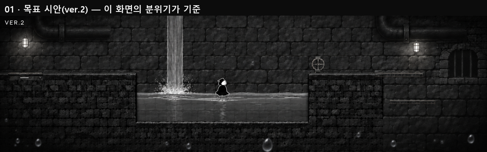
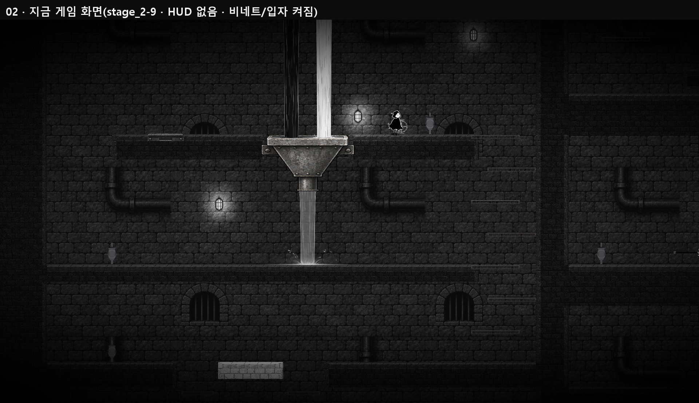
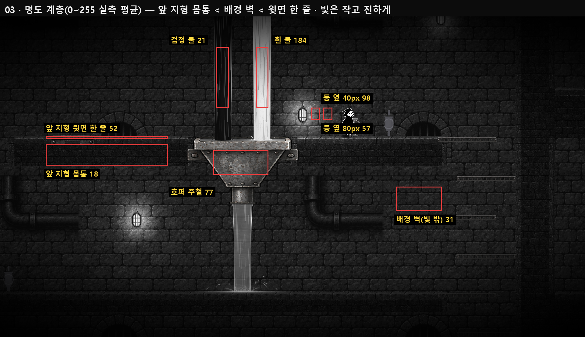
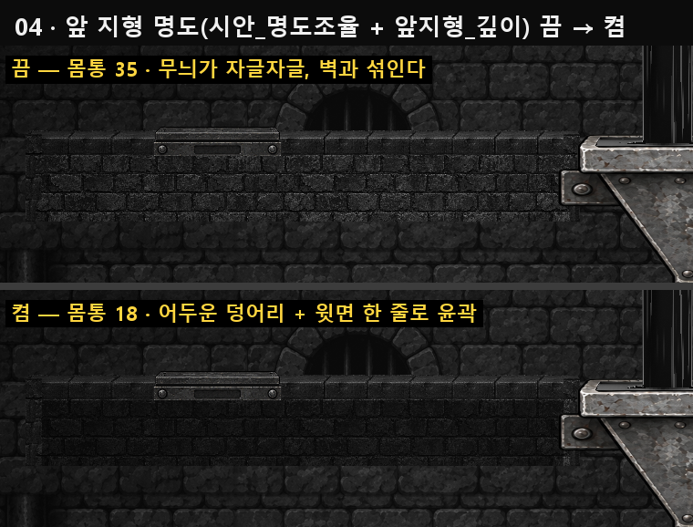
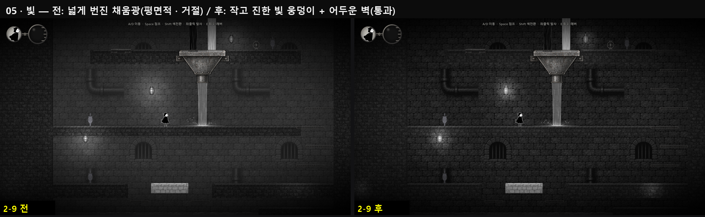
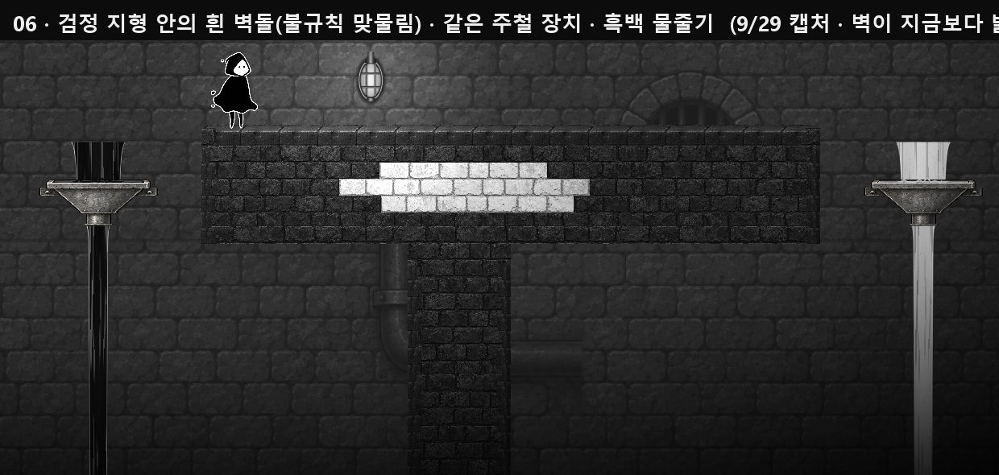
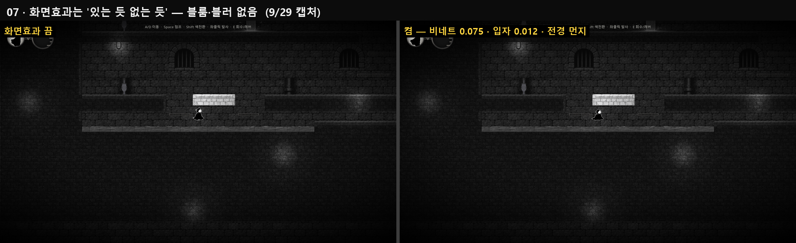
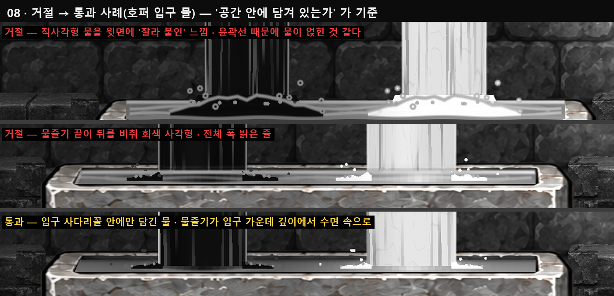

# GRAY 분위기 가이드 — 하수도(스테이지 2)의 톤을 집(주택) 스테이지로 이어가기

작성: 2026-09-30 · 도형(하수도 담당) → 집 스테이지 담당 팀원
대상 저장소: `color-dev_4` · 브랜치 `dev_4` · Godot 4.6.3 (Compatibility 렌더러)

> **이 문서의 목적**
> 하수도와 집은 **소재가 다르지만 같은 게임**이다. 플레이어가 하수도에서 집으로 넘어가도
> "같은 세계, 같은 손으로 만든 화면"으로 느껴지게 하려고, 하수도에서 정해진 **분위기의 규칙**
> (명도·빛·재질·입체감·화면효과)을 수치와 함께 넘긴다.
>
> - 벽돌·배관·철창 같은 **하수도 소재를 복사하지 않는다.** 복사할 것은 "어떻게 어둡고, 어떻게 빛나고, 어떻게 두께가 보이는가" 이다.
> - SS2D 부위 제작·배경 레이어 **절차**는 이미 있는 [스테이지1_플랫폼과배경_공통제작가이드_팀원전달.md](스테이지1_플랫폼과배경_공통제작가이드_팀원전달.md) 를 따른다. 이 문서는 그 위에 얹는 **분위기 기준서**다.
> - 아래 수치는 하수도에서 **실제 화면으로 비교해 고른 값**이다. 집에서는 출발점으로 쓰고, 집 원화에 맞춰 조정하되 **조정한 이유를 기록**한다.

---

## 0. 먼저 볼 화면 (5분)

> 그림은 이 문서 옆 폴더 `팀원전달_분위기가이드_이미지/` 에 있다. **문서와 폴더를 같이 보낸다.**
> 그림을 다시 만들려면: `tools/촬영_가이드장면.gd`(게임 캡처) → `python tools/만들기_분위기가이드_이미지.py`.

| 더 볼 것 | 파일 |
|---|---|
| 승인된 목표 시안(아래 ver.2 가 기준) | `docs/visual_review/ver2_stage29_baseline/approved_ver2_reference.png` |
| 실제 게임 화면 11 스테이지 | `docs/visual_review/stage8_all/2-*.png` (예: `2-3_3560.png`) |
| 벽·벽등 깊이감 조정 전/후 | `docs/visual_review/lamp_depth_20260929/` |
| 호퍼 입구 "담긴 물" 시안 과정 | `docs/visual_review/hopper_inlet_20260930/` (v2 → v4) |
| 직접 플레이 | F5 → 로비 → 하수도 스테이지(`scenes/world_2_클로드/stage_2-9.tscn` 을 F6 로 바로 열어도 된다) |

---

## 1. 한 줄 정체성

**"어둡고 조용한 흑백 공간에, 작고 진한 빛 몇 개가 무거운 재질의 두께를 드러낸다."**

키워드: 흑백 다크판타지 · 정적 · 낡고 무거운 재질 · 국소 조명 · 얇지만 분명한 두께 · 과장 없는 효과.

하수도에서 이게 된 모습: 벽 대부분이 거의 검정에 가까운 어둠 속에 묻혀 있고, 캡슐형 벽등 주변만 돌 질감이 드러난다.
발판은 벽보다 더 어두운 덩어리인데, 윗면 한 줄(갓돌)만 밝아 "딛는 선"이 읽힌다. 물과 흰 지형은 이 어둠 위에서 또렷하게 뜬다.

집에서 기대하는 모습(해석 예): 밤의 집. 불 꺼진 방에 **창틈 달빛·스탠드·촛불·복도 벽등** 몇 개만 켜져 있고,
그 주변에서만 나뭇결·벽지 무늬·벽돌 요철이 드러난다. 가구와 바닥은 어두운 덩어리, 마루 끝·선반 윗면만 밝은 선.
(챕터표 `scripts/스마트월드/챕터.gd` 의 집 설명도 "빛이 창틈으로만 들어오는 조용한 집" 이다.)

---

## 2. 명도 설계 — 가장 중요한 규칙

흑백 게임이라 **명도 = 전부**다. 하수도는 아래 계층을 지킨다.
숫자는 지금 게임 화면(2-9 · 1920×1080 · 줌 1.0 · 화면효과 켬)에서 **직접 잰 평균 회색값(0~255)** 이다 — 아래 그림 03.

| 층 | 하수도 실측 | 역할 | 집에서 |
|---|---|---|---|
| 배경 벽(빛 밖) | **31** | 공간을 채우되 눈을 끌지 않는다 | 벽지·회벽·먼 벽. 같은 어둠대 유지 |
| 배경 벽(등 옆) | 40px **98** → 80px **57** | "작고 진한 빛 웅덩이" — 금방 어둠으로 돌아간다 | 스탠드·창 주변만 밝게 |
| 앞 지형 몸통(검정) | **18** | 배경보다 **더 어둡고 차분한** 덩어리 | 마루·가구 몸통 |
| 앞 지형 윗면(갓돌 한 줄) | **52** | 딛는 선. 몸통과 대비로 윤곽이 선다 | 마루 끝·선반 윗면·창틀 윗면 |
| 장치(주철 호퍼) | **77** | 지형보다 한 단 밝은 금속 — 조작 대상이 읽힌다 | 문고리·스위치·장치 |
| 검정 물 / 흰 물 | **21** / **184** | 규칙 색. 흰색도 순백(255)까지 올리지 않는다 | 흰 가구·흰 천·흰 타일도 같은 원리 |
| 캐릭터 | 흑/백 실루엣 | 어떤 배경에서도 읽혀야 한다 | 그대로 |

앞 지형 명도 처리를 껐을 때와 켰을 때(같은 자리):

규칙:
1. **검정/흰색은 게임 규칙이다**(몸에 닿은 지형이 내 색과 다르면 즉사 · 회색은 안전). 조명·음영 때문에 검정 면이 흰색처럼, 흰 면이 회색처럼 보이면 실패다.
2. **벽(배경)보다 앞 지형 몸통이 더 어둡다.** 대신 앞 지형은 윗면 한 줄로 윤곽을 세운다. 배경이 앞 지형보다 어두우면 발판이 배경에 녹고, 앞 지형이 밝으면 화면이 평평해진다.
3. 흰 지형 **바로 위**에 세기 1.0 넘는 광원을 두지 않는다 — 순백으로 뭉갠다. 빛은 **검정 지형을 읽히게 하려고** 놓는다.
4. 회색은 배경·거리·재질 음영에 써도 되지만, 실제 안전 지형(회색)과 **대비·선명도로 구분**한다.

하수도에서 이 계층을 만든 실제 값(참고용 · 같은 셰이더를 집 재질에 쓸 경우):
- 배경 벽 명도 곡선: `tone_curve (0.25, 0.165, 0.85)` · `tone_limits (0.04, 0.27)` — `scenes/배경/하수도_벽돌배경_2_9_조정.tscn`
- 앞 지형: `sewer_natural_platform.gdshader` 의 `reference_tone`(검정×0.82+0.018 / 흰×0.78+0.08) + `front_depth`(검정 몸통만 `mix(0.045, 검정×0.62, 0.78)`). 지형 인스펙터 `시안_명도조율` · `앞지형_깊이` 로 켠다. 2-1~2-9 전부 켜져 있다.

---

## 3. 빛 — "근거 있는, 작고 진한, 월드에 고정된" 빛

### 원칙
- **광원마다 근거가 있다.** "원화(배경 그림)의 어디가 밝아서 여기에 빛을 둔다" 를 적는다. 근거 없는 채움광(화면을 고르게 밝히는 빛) 금지.
  - 원화 밝은 자리 재는 도구: `tools/측정_원화_광원자리.gd -- --씬=<경로> --노드=<배경노드>` (월드 좌표로 알려 준다).
- **넓게 번지는 빛 = "평면적"**. 하수도 초기 벽등은 반경 320 · 세기 1.15 로 넓게 퍼졌고 "너무 평면적" 이라는 판정을 받았다. 반경을 줄이고 세기를 올려 **작고 진한 웅덩이**로 바꾼 뒤 통과했다.
- 빛은 **월드에 고정**된다. 플레이어가 빛 안을 지나갈 때 명암·그림자가 바뀌는 것이 목표다. 광원이 플레이어를 따라다니지 않는다(예외: 아래 보조광).
- **빛 = 방향.** 광원 높이를 낮게(90) 두어 빛이 벽을 비스듬히 스치게 하면 벽돌 윗면/아랫면에 명암이 생겨 입체감이 난다.

### 수치
| 항목 | 값 | 파일 |
|---|---|---|
| 프로젝트 조명 표준 | height **128** · 기준 반경 **700** · 세기 **1.6** · blend **ADD** · 실내 어둠(CanvasModulate) **0.62** · 그림자 알파 **0.60** | `scripts/스마트월드/조명표준.gd` (유일한 출처 · 광원 만들 때 `조명표준.적용(빛)`) |
| 하수도 벽등(실측 튜닝) | 반경 **230** · 세기 **3.0** · height **90** · 그림자 켬(PCF5 · 알파 0.80) | `scripts/스마트월드/하수도_실시간벽등.gd` |
| 플레이어 보조광 | 세기 **0.35** · 반경 **300** · **그림자 끔** | `scripts/플레이어_보조광.gd` (켜면 점프마다 그림자가 흔들려 부산스럽다) |
| 광원 본체(등 유리) | `unshaded` — 월드 조명에 묻히지 않게. 서리유리 0.80~0.99, 쇠 테두리 0.035~0.06 | `shaders/sewer_lamp_glass.gdshader` · `sewer_lamp_realtime.gdshader` |
| 집 챕터 어둠 | 챕터표 집 `어둠 = (0.72, 0.74, 0.70)` | `scripts/스마트월드/챕터.gd` |

집에서의 해석:
- 창문 = 방향이 있는 빛. `PointLight2D`(지형을 밝힘) + `빛기둥` 모드 0(어디서 오는 빛인지 그림)을 **짝**으로 둔다. ⚠ 빛기둥 모드 1·2 는 **색 판정에 관여**하므로 연출용으로 쓰지 않는다.
- 바닥에 눕는 빛(창빛이 마루에 떨어진 자국)은 발광체 `종류 = 2`(납작한 반사광).
- 광원 배치는 씬을 손으로 고치지 말고 `tools/조명_배치.gd` 의 배치표를 고친다(멱등).
- 광원이 한 화면에 20 개 안팎이 하수도 수준이다. 한 지형에 겹치는 광원은 엔진 한계 15 — `tools/진단_절차생성_예산.gd` 로 잰다.

---

## 4. 재질과 입체감 — "얇지만 분명한 두께"

### 하수도가 한 것
- **배경 벽**: 거친 석재 벽돌 원화 + 수제 노멀맵(`relief_depth 2.0`). 낮은 광원이 요철을 드러낸다.
- **발판**: 앞에서 본 평면 + **얇은 윗면(갓돌) 한 줄** + 끝이 안으로 들어가는 사다리꼴 마감 + 노출된 곳만 옆면.
  윗면 가운데가 실제 발 접촉선(위아래 약 4px). 플레이어·충돌을 장식 때문에 옮기지 않는다.
- **공중 선반**: 두꺼운 벽 조각이 아니라 **얇은 상면 + 깨진 밑면/끝 실루엣**.
- **흑백 맞물림**: 검정/흰 지형이 맞닿는 경계는 반 장~두 장 깊이로 **불규칙하게** 맞물린다(지퍼처럼 반복·회색 블렌딩 금지). 검정 안의 흰 벽돌 무늬(내부 무늬)도 있다.
- **장치 재질 통일**: 호퍼·가시·톱·레버·밸브·압력판이 전부 **같은 주철** 계열(어둡고 거친 금속 · 가는 반짝임 선 한 줄). 따로 놀지 않는다.

### 집으로 옮길 원칙
1. **두께는 "얇은 윗면 한 줄 + 고정된 보는 각도"로만** 표현한다. 3D 처럼 원근을 바꾸지 않는다.
2. 윗면(딛는 선)은 몸통보다 밝다. 마루 끝 몰딩·선반 모서리·창틀 윗면이 하수도 갓돌 역할.
3. **흰 테두리를 텍스처에 굽지 않는다.** 모든 발판을 두르는 상시 흰 외곽선은 거절된 방향이다.
4. 검정/흰 재질은 **같은 무늬(나뭇결·줄눈·균열)를 공유**한다. 흰색을 단순 밝기 반전으로만 만들면 음영이 뒤집혀 입체감이 무너진다.
5. 재질 계열을 적게: 집은 이미 **나무(방 안) / 벽돌(벽·기둥)** 규칙이 있다(`docs/작업기록_2026-09-03_Claude_배경깊이_나무벽돌_투명발판.md`). 장치를 새로 그린다면 한 계열(예: 오래된 놋쇠·주철)로 통일한다.
6. 재질별 노멀 세기(LOCK): WOOD 1.6 · GRASS 0.9 · IRON 1.4 · BRICK 수제 — `tools/생성_지형_노멀맵.gd`. 조명·노멀 확인은 `scenes/집/테스트_2층방_노멀맵.tscn` F6(집용 검증 랩이 이미 있다).

---

## 5. 배경

| 항목 | 하수도 값 | 집에서 |
|---|---|---|
| 구성 | 벽돌 원화 1 장을 `Parallax2D` 로 반복 (타일 998.4×665.6 · 그림 배율 0.65) · z **-100** | 방마다 원화가 있으면 원화 우선. 반복 타일이면 반복 경계가 안 보이게 |
| 시차 | `scroll_scale 1.0` (지형과 같이 움직임 — 벽이 바로 뒤에 있는 공간) | 방 벽은 1.0 가까이, 창 너머 바깥만 작게 |
| 대비 | 배경은 앞 지형보다 **대비 낮게**, 중간톤 위주 | 같음 — 먼 것은 흐리고 차분하게 |
| 반복감 | 원화에 배관·철창이 그려져 있어 반복이 눈에 띄는 문제가 남았다 | 액자·창·문 같은 **눈에 띄는 구조물은 반복 타일에 굽지 말고** 별도 배치 |

배경 층 나누기·빈 공간 방지 등 절차는 [공통제작가이드 §6](스테이지1_플랫폼과배경_공통제작가이드_팀원전달.md) 그대로.

---

## 6. 화면 효과 — "있는 듯 없는 듯"

하수도 ver.2 화면효과(`scenes/배경/하수도_화면효과_v2.tscn` · 셰이더 `shaders/sewer_camera_v2.gdshader`):

| 효과 | 값 | 비고 |
|---|---|---|
| 비네트 | **0.075** | 가장자리만 살짝 |
| 필름 입자 | **0.012** | 거의 안 보이는 정도가 맞다 |
| 전경 파티클 | 12 개 · 느리고 작은 반투명 입자 | 집에서는 **창빛 속 먼지**로 그대로 어울린다 |
| 입수 물방울 | 3~5 개 · 반지름 2~4px · 0.3~0.5 초 · 화면 하단만 | 물이 있는 곳에만 |
| 금지 | 전체 블룸 · 모션블러 · 화면 복사 후처리 | 물과 흰 지형이 번져 색 규칙이 흐려진다 |

CanvasLayer 5(HUD 는 100) · 입력을 가로채지 않음(mouse_filter IGNORE). 집에서 쓰려면 이 씬을 인스턴스하고 강도만 조절하면 된다.

---

## 7. 물·흑백 색 언어 (집에 물이 나온다면)

| 색 | 표현 | 금지 |
|---|---|---|
| 검정 물 | 짙은 본체 + 절제된 은빛 반사 | 검정이 회색으로 떠 보이는 것 |
| 흰 물 | 밝고 밀도 있는 흰색 + 내부의 작은 명암·흐름 | 균일한 흰 종이 띠 · 일정 간격 평행선 |
| 회색 물 | 뒤가 비치는 반투명·굴절 | 불투명 회색 관 |

- 물줄기가 무언가에 들어갈 때는 **떨어진 자리의 깊이**를 지킨다(호퍼 입구 v4: 물이 입구 앞뒤 가운데로 들어가고, 입구 모양 안에만 담긴다 · 들어오는 물 색 = 검정/흰/둘 다면 회색).
- 흰 물이 튀는 방울은 흰색. 어두운 회색은 수면의 얇은 잔물결·접촉 음영에만.

---

## 8. 하지 말 것 — 실제로 거절된 것들

판단 기준은 하나다: **"그 물건이 공간 안에 있는가, 화면 위에 붙어 있는가."** 아래는 실제로 거절 → 통과된 과정이다.

| 거절된 모습 | 왜 | 대신 |
|---|---|---|
| 넓은 채움광으로 화면이 고르게 밝음 | "평면적" — 어디서 오는 빛인지 사라짐 | 작고 진한 빛 웅덩이 · 근거 있는 광원 |
| 종이를 잘라 붙인 듯한 물·장식 | 재질이 공간 안에 있지 않음 | 담긴 모양·깊이 순서(뒤→대상→앞)를 지킨다 |
| 모든 발판에 흰 외곽선 | 멀어져도 안 사라지는 선 | 윗면 한 줄 + 명도 계층 |
| 가로로 긴 밝은 회색 줄(물테·결) | 작은 화면에서 "그은 선"으로 읽힘 | 접촉부는 밝은 선이 아니라 옅은 그늘 |
| 흰 지형 위 센 광원 | 순백으로 뭉갬 | 빛은 검정 지형 쪽에 |
| 전체 블룸·블러 | 색 규칙이 흐려짐 | 국소 번짐(광원 주변 36px 정도)만 |
| 반복 타일에 구조물 굽기 | 반복이 눈에 띔 | 구조물은 따로 배치 |

---

## 9. 성능 — 분위기 작업이 프레임을 먹지 않게 (2026-09-30 실측 교훈)

목표: **60FPS 밑으로 떨어지지 않는다.** 측정 PC(내장 GPU · 1080p) 기준 하수도 평소 8~10ms.

1. **셰이더에 `TIME` 을 쓰지 않는다.** TIME 을 읽는 그림이 화면에 하나라도 있으면 Godot 에디터가 쉬지 않고 다시 그려 GPU 를 41% 까지 쓰고, F5 로 켠 게임이 33FPS 로 떨어졌다. 움직임은 `uniform float anim_time` 을 두고 스크립트가 **게임 중에만** 넣는다(본보기 `scripts/스마트월드/흰물_디자인.gd`).
2. **@tool 스크립트의 `_process` 에서 조건 없이 `queue_redraw()` 금지.** 에디터에서는 값이 바뀐 때만(`scripts/스마트월드/에디터_다시그리기.gd` 의 `서명()`).
3. 같은 값을 `position` 에 매 프레임 다시 넣지 않는다(같아도 변환 알림이 가서 주변이 일을 한다).
4. 에디터에서 씬 저장 뒤 `python tools/정리_SS2D_클릭사각형_흔적.py` — SS2D 클릭 영역 흔적이 저장되면 로드가 수 초 걸린다.
5. 확인 도구: `tools/측정_하수도_프레임.gd -- <씬경로> --칸=60`(창 모드 · 16.7ms 초과 0 이어야 함) · `tools/진단_에디터_계속그리기.gd -- <씬경로>`("쉼 ✔" 이어야 함). 이름은 하수도지만 **아무 씬이나** 넣을 수 있다.

---

## 10. 하수도 → 집 번역표 (요약)

| 하수도 | 집(해석 예) | 지킬 것 |
|---|---|---|
| 거친 석재 벽돌 배경 | 벽지·회벽·나무 판벽 / 벽돌 기둥 | 배경 명도 약 31 · 대비 낮게 |
| 캡슐형 벽등(작고 진한 빛) | 스탠드·촛불·복도 벽등·창틈 달빛 | 반경 작게·세기 높게 · 낮은 높이로 스치는 빛 · 근거 기록 |
| 발판 몸통(어두운 덩어리) + 갓돌 한 줄 | 마루·가구 몸통 + 마루 끝 몰딩·선반 윗면 | 몸통 < 배경 명도 · 윗면 한 줄로 윤곽 |
| 공중 선반(얇은 상면 + 깨진 밑면) | 벽 선반·책장 칸·창턱 | 두꺼운 상자로 만들지 않기 |
| 흑백 맞물림 경계 | 흑백 타일·마루 조각 경계 | 불규칙 맞물림 · 회색 블렌딩 금지 |
| 주철 장치 | 오래된 놋쇠/주철 가구 부속 | 장치 재질 한 계열로 통일 |
| 물 흐르는 소리·물방울 | 삐걱임·시계·창밖 바람 (BGM 톤은 챕터표) | 조용함 유지 |
| 비네트 0.075 · 입자 0.012 · 전경 입자 12 | 같은 값 + 창빛 먼지 | 과장 금지 |

---

## 11. 완료 체크리스트

- [ ] 멀리서도 배경 / 앞 지형 / 검정 / 흰색이 한눈에 구분된다.
- [ ] 배경이 앞 지형보다 밝고, 앞 지형 몸통은 윗면 한 줄로 윤곽이 선다.
- [ ] 광원마다 "원화 어디가 밝아서" 근거가 적혀 있고, 화면 전체를 고르게 밝히는 빛이 없다.
- [ ] 흰 지형 위에 센 광원이 없고, 흰 지형이 순백으로 뭉개지지 않는다.
- [ ] 텍스처에 구운 흰 외곽선·가로로 긴 밝은 줄이 없다.
- [ ] 화면효과는 비네트·입자·먼지 수준이고 블룸·블러가 없다.
- [ ] 셰이더에 TIME 이 없고, 에디터 진단이 "쉼 ✔", 프레임 측정이 16.7ms 초과 0.
- [ ] 하수도 스테이지 한 장면과 나란히 놓고 봐도 같은 게임처럼 보인다(스크린샷 비교를 기록에 남긴다).
- [ ] 수치를 바꿨다면 "무엇을 · 왜 · 실제 화면으로 비교했는지" 를 `docs/작업기록_<날짜>_<이름>_<요약>.md` 에 남겼다.

---

## 12. 파일 위치 한눈에

| 무엇 | 경로 |
|---|---|
| 조명 표준(유일한 출처) | `scripts/스마트월드/조명표준.gd` |
| 하수도 벽등 | `scripts/스마트월드/하수도_실시간벽등.gd` · `shaders/sewer_lamp_*.gdshader` |
| 하수도 배경(명도·노멀) | `scenes/배경/하수도_벽돌배경_2_9_조정.tscn` · `shaders/sewer_wall_realtime.gdshader` |
| 앞 지형 명도·깊이 | `shaders/sewer_natural_platform.gdshader` · `scripts/스마트월드/하수도_자연발판.gd` |
| 화면효과 | `scenes/배경/하수도_화면효과_v2.tscn` · `scripts/스마트월드/하수도_화면효과_v2.gd` · `shaders/sewer_camera_v2.gdshader` |
| 챕터별 어둠·BGM 톤 | `scripts/스마트월드/챕터.gd` |
| 광원 배치표(멱등 도구) | `tools/조명_배치.gd` · 원화 밝기 측정 `tools/측정_원화_광원자리.gd` |
| 집 조명·노멀 검증 랩 | `scenes/집/테스트_2층방_노멀맵.tscn` (F6) |
| SS2D·배경 제작 절차 | `docs/스테이지1_플랫폼과배경_공통제작가이드_팀원전달.md` |
| ver.2 과정 기록 | `docs/작업기록_2026-09-28~29_Codex_ver2_*.md` · `docs/작업기록_2026-09-29_Claude_벽등_깊이감_123.md` · `docs/작업기록_2026-09-29_Claude_ver2_8단계_전스테이지확장.md` |
| 성능 교훈 | `docs/작업기록_2026-09-30_Claude_프레임드랍_원인_수정.md` |

질문·조율이 필요한 것(공용 셰이더·플레이어 조명·색 판정 규칙 변경)은 도형에게 먼저 묻는다. 하수도 파일을 직접 고쳐야 하면 사본을 만들어 집 전용으로 쓰는 것을 기본으로 한다.
